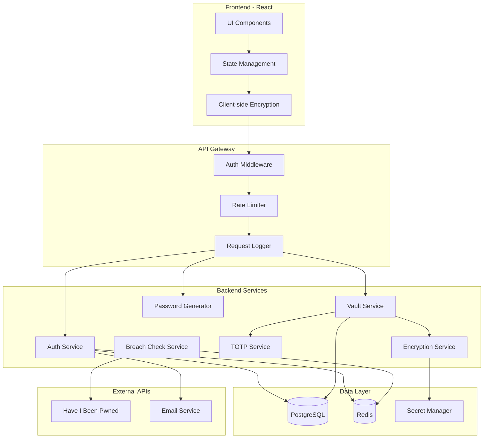
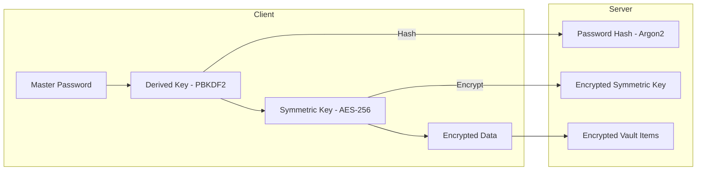

# VoltVault - API Architecture

## 1. Architecture Overview



---

## 2. API Design Principles

| Principle | Implementation |
|-----------|----------------|
| RESTful | Standard HTTP methods, resource-based URLs |
| Zero-Knowledge | Server never sees plaintext passwords |
| Versioned | `/api/v1/` prefix for all endpoints |
| Paginated | Cursor-based pagination for list endpoints |
| Rate Limited | Per-user and per-IP rate limiting |

---

## 3. Authentication Endpoints

**Base URL:** `/api/v1/auth`

| Method | Endpoint | Description |
|--------|----------|-------------|
| POST | `/register` | Create new user account |
| POST | `/login` | Authenticate and receive tokens |
| POST | `/logout` | Invalidate session |
| POST | `/refresh` | Refresh access token |
| POST | `/password-reset/request` | Request reset email |
| POST | `/password-reset/confirm` | Complete password reset |

### POST `/register`
```json
// Request
{
    "email": "user@example.com",
    "masterPasswordHash": "sha256_hash",
    "encryptionKey": "encrypted_symmetric_key",
    "hint": "Optional hint"
}

// Response 201
{
    "userId": "uuid",
    "email": "user@example.com",
    "createdAt": "2024-01-15T10:00:00Z"
}
```

### POST `/login`
```json
// Request
{
    "email": "user@example.com",
    "masterPasswordHash": "sha256_hash"
}

// Response 200
{
    "accessToken": "jwt_token",
    "refreshToken": "refresh_token",
    "expiresIn": 3600,
    "user": {
        "id": "uuid",
        "email": "user@example.com",
        "encryptionKey": "encrypted_key"
    }
}
```

---

## 4. Vault Endpoints

**Base URL:** `/api/v1/vault`

| Method | Endpoint | Description |
|--------|----------|-------------|
| GET | `/items` | List all vault items |
| POST | `/items` | Create vault item |
| GET | `/items/:id` | Get single item |
| PUT | `/items/:id` | Update item |
| DELETE | `/items/:id` | Delete item |
| PATCH | `/items/:id/favorite` | Toggle favorite |

### GET `/items`
```json
// Query: ?cursor=abc&limit=50&type=login&folder=id&favorite=true&search=term

// Response 200
{
    "items": [
        {
            "id": "uuid",
            "type": "login",
            "encryptedData": "base64_blob",
            "folderId": "folder_uuid",
            "favorite": true,
            "createdAt": "2024-01-15T10:00:00Z",
            "updatedAt": "2024-01-16T12:30:00Z"
        }
    ],
    "nextCursor": "def456",
    "total": 142
}
```

### POST `/items`
```json
// Request
{
    "type": "login",
    "encryptedData": "base64_blob",
    "folderId": "folder_uuid",
    "favorite": false
}

// Response 201
{
    "id": "new_uuid",
    "type": "login",
    "encryptedData": "base64_blob",
    "createdAt": "2024-01-15T10:00:00Z"
}
```

---

## 5. Folder Endpoints

**Base URL:** `/api/v1/folders`

| Method | Endpoint | Description |
|--------|----------|-------------|
| GET | `/` | List all folders |
| POST | `/` | Create folder |
| PUT | `/:id` | Rename folder |
| DELETE | `/:id` | Delete folder |

---

## 6. Security Endpoints

**Base URL:** `/api/v1/security`

| Method | Endpoint | Description |
|--------|----------|-------------|
| GET | `/stats` | Dashboard statistics |
| GET | `/recent-access` | Recent access log |
| POST | `/check-breach` | Check password breach |
| POST | `/analyze-password` | Analyze strength |

### GET `/stats`
```json
// Response 200
{
    "totalItems": 142,
    "healthScore": 98,
    "weakPasswords": 2,
    "duplicatePasswords": 3,
    "oldPasswords": 15,
    "breachedCredentials": 0,
    "twoFactorEnabled": 45,
    "alertLevel": "LOW"
}
```

---

## 7. TOTP Endpoints

**Base URL:** `/api/v1/totp`

### POST `/generate`
```json
// Request
{ "itemId": "uuid" }

// Response 200
{
    "code": "123456",
    "remaining": 18,
    "period": 30
}
```

---

## 8. User Endpoints

**Base URL:** `/api/v1/user`

| Method | Endpoint | Description |
|--------|----------|-------------|
| GET | `/profile` | Get user profile |
| PATCH | `/profile` | Update profile |
| PUT | `/master-password` | Change master password |

---

## 9. Error Responses

```json
{
    "error": {
        "code": "VALIDATION_ERROR",
        "message": "Email is required",
        "details": { "field": "email", "issue": "missing" }
    }
}
```

| Status | Code | Description |
|--------|------|-------------|
| 400 | VALIDATION_ERROR | Invalid request |
| 401 | UNAUTHORIZED | Invalid token |
| 403 | FORBIDDEN | No permission |
| 404 | NOT_FOUND | Resource missing |
| 429 | RATE_LIMITED | Too many requests |

---

## 10. Encryption Model



---

## 11. Security Measures

| Measure | Implementation |
|---------|----------------|
| Password Hashing | Argon2id with salt |
| Key Derivation | PBKDF2 - 100,000 iterations |
| Data Encryption | AES-256-GCM client-side |
| Transport | TLS 1.3 only |
| TOTP | RFC 6238 compliant |
| Session | Short-lived JWTs (1 hour) |

---

## 12. Rate Limits

| Endpoint | Limit | Window |
|----------|-------|--------|
| `/auth/login` | 5 req | 15 min |
| `/auth/register` | 3 req | 1 hour |
| `/auth/password-reset/*` | 3 req | 1 hour |
| Authenticated endpoints | 100 req | 1 min |
| `/security/check-breach` | 10 req | 1 min |

---

## 13. Request Headers

```http
Authorization: Bearer <jwt_token>
Content-Type: application/json
X-Client-Version: 1.0.0
```
