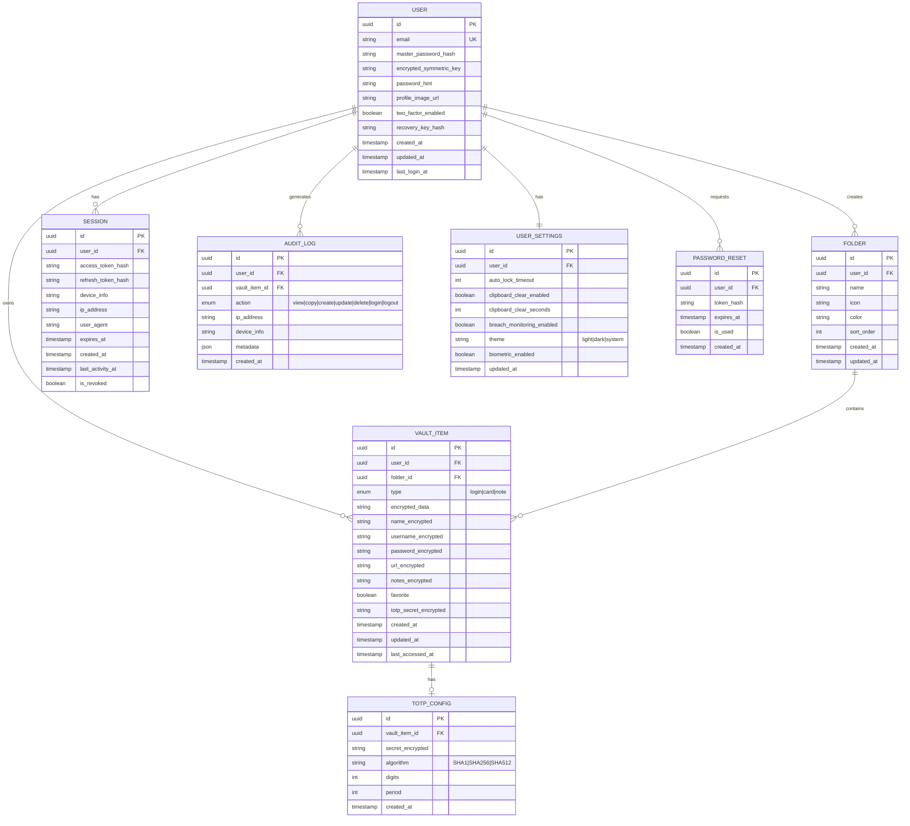

# VoltVault - Entity Relationship Diagram

## Database Schema Overview

This document describes the entity relationships for the VoltVault password management system.

---

## Entity Relationship Diagram



---

## Entity Descriptions

### USER
The core entity representing a registered user of the VoltVault system.

| Field | Type | Description |
|-------|------|-------------|
| `id` | UUID | Primary key |
| `email` | VARCHAR(255) | Unique email address for authentication |
| `master_password_hash` | VARCHAR(255) | Argon2id hash of the master password |
| `encrypted_symmetric_key` | TEXT | User's symmetric key encrypted with derived key |
| `password_hint` | VARCHAR(255) | Optional hint for password recovery |
| `profile_image_url` | VARCHAR(512) | URL to user's profile image |
| `two_factor_enabled` | BOOLEAN | Whether 2FA is enabled for the account |
| `recovery_key_hash` | VARCHAR(255) | Hash of the recovery key |
| `created_at` | TIMESTAMP | Account creation timestamp |
| `updated_at` | TIMESTAMP | Last profile update timestamp |
| `last_login_at` | TIMESTAMP | Last successful login timestamp |

---

### VAULT_ITEM
Stores encrypted credentials, payment cards, and secure notes.

| Field | Type | Description |
|-------|------|-------------|
| `id` | UUID | Primary key |
| `user_id` | UUID | Foreign key to USER |
| `folder_id` | UUID | Foreign key to FOLDER (nullable) |
| `type` | ENUM | Item type: `login`, `card`, or `note` |
| `encrypted_data` | TEXT | Full encrypted payload (blob) |
| `name_encrypted` | TEXT | Encrypted item name (for listing) |
| `username_encrypted` | TEXT | Encrypted username (logins only) |
| `password_encrypted` | TEXT | Encrypted password (logins only) |
| `url_encrypted` | TEXT | Encrypted URL (logins only) |
| `notes_encrypted` | TEXT | Encrypted notes |
| `favorite` | BOOLEAN | Whether item is marked as favorite |
| `totp_secret_encrypted` | TEXT | Encrypted TOTP secret (if enabled) |
| `created_at` | TIMESTAMP | Item creation timestamp |
| `updated_at` | TIMESTAMP | Last modification timestamp |
| `last_accessed_at` | TIMESTAMP | Last time item was viewed/copied |

---

### FOLDER
Organizational folders for grouping vault items.

| Field | Type | Description |
|-------|------|-------------|
| `id` | UUID | Primary key |
| `user_id` | UUID | Foreign key to USER |
| `name` | VARCHAR(100) | Folder display name |
| `icon` | VARCHAR(50) | Icon identifier |
| `color` | VARCHAR(7) | Hex color code |
| `sort_order` | INTEGER | Display order position |
| `created_at` | TIMESTAMP | Folder creation timestamp |
| `updated_at` | TIMESTAMP | Last update timestamp |

---

### SESSION
Tracks active user sessions for authentication.

| Field | Type | Description |
|-------|------|-------------|
| `id` | UUID | Primary key |
| `user_id` | UUID | Foreign key to USER |
| `access_token_hash` | VARCHAR(255) | Hashed JWT access token |
| `refresh_token_hash` | VARCHAR(255) | Hashed refresh token |
| `device_info` | VARCHAR(255) | Device/browser information |
| `ip_address` | VARCHAR(45) | Client IP address |
| `user_agent` | TEXT | Full user agent string |
| `expires_at` | TIMESTAMP | Session expiration time |
| `created_at` | TIMESTAMP | Session creation timestamp |
| `last_activity_at` | TIMESTAMP | Last activity timestamp |
| `is_revoked` | BOOLEAN | Whether session has been revoked |

---

### AUDIT_LOG
Security audit trail for all user actions.

| Field | Type | Description |
|-------|------|-------------|
| `id` | UUID | Primary key |
| `user_id` | UUID | Foreign key to USER |
| `vault_item_id` | UUID | Foreign key to VAULT_ITEM (nullable) |
| `action` | ENUM | Action type: `view`, `copy`, `create`, `update`, `delete`, `login`, `logout` |
| `ip_address` | VARCHAR(45) | Client IP address |
| `device_info` | VARCHAR(255) | Device information |
| `metadata` | JSONB | Additional action-specific data |
| `created_at` | TIMESTAMP | Action timestamp |

---

### USER_SETTINGS
User preferences and security settings.

| Field | Type | Description |
|-------|------|-------------|
| `id` | UUID | Primary key |
| `user_id` | UUID | Foreign key to USER |
| `auto_lock_timeout` | INTEGER | Minutes before auto-lock (0 = disabled) |
| `clipboard_clear_enabled` | BOOLEAN | Auto-clear clipboard after copy |
| `clipboard_clear_seconds` | INTEGER | Seconds before clipboard clear |
| `breach_monitoring_enabled` | BOOLEAN | Enable breach monitoring |
| `theme` | ENUM | UI theme: `light`, `dark`, `system` |
| `biometric_enabled` | BOOLEAN | Enable biometric unlock |
| `updated_at` | TIMESTAMP | Last settings update |

---

### TOTP_CONFIG
Two-factor authentication configuration for vault items.

| Field | Type | Description |
|-------|------|-------------|
| `id` | UUID | Primary key |
| `vault_item_id` | UUID | Foreign key to VAULT_ITEM |
| `secret_encrypted` | TEXT | Encrypted TOTP secret key |
| `algorithm` | ENUM | Hash algorithm: `SHA1`, `SHA256`, `SHA512` |
| `digits` | INTEGER | Number of digits (default: 6) |
| `period` | INTEGER | Rotation period in seconds (default: 30) |
| `created_at` | TIMESTAMP | Configuration creation timestamp |

---

### PASSWORD_RESET
Tracks password reset requests.

| Field | Type | Description |
|-------|------|-------------|
| `id` | UUID | Primary key |
| `user_id` | UUID | Foreign key to USER |
| `token_hash` | VARCHAR(255) | Hashed reset token |
| `expires_at` | TIMESTAMP | Token expiration time |
| `is_used` | BOOLEAN | Whether token has been used |
| `created_at` | TIMESTAMP | Request timestamp |

---

## Indexes

### Performance Indexes
```sql
-- User lookup
CREATE UNIQUE INDEX idx_user_email ON user(email);

-- Vault item queries
CREATE INDEX idx_vault_item_user_id ON vault_item(user_id);
CREATE INDEX idx_vault_item_folder_id ON vault_item(folder_id);
CREATE INDEX idx_vault_item_type ON vault_item(user_id, type);
CREATE INDEX idx_vault_item_favorite ON vault_item(user_id, favorite) WHERE favorite = true;

-- Folder queries
CREATE INDEX idx_folder_user_id ON folder(user_id);

-- Session management
CREATE INDEX idx_session_user_id ON session(user_id);
CREATE INDEX idx_session_expires_at ON session(expires_at) WHERE is_revoked = false;

-- Audit log queries
CREATE INDEX idx_audit_log_user_id ON audit_log(user_id);
CREATE INDEX idx_audit_log_created_at ON audit_log(created_at);
CREATE INDEX idx_audit_log_vault_item_id ON audit_log(vault_item_id) WHERE vault_item_id IS NOT NULL;
```

---

## Security Notes

1. **Zero-Knowledge Architecture**: All sensitive data (`*_encrypted` fields) is encrypted client-side before transmission
2. **Password Hashing**: Master passwords are hashed using Argon2id with unique salts
3. **Token Hashing**: Session tokens are stored as hashes, never in plaintext
4. **Audit Trail**: All sensitive operations are logged for security monitoring
5. **Soft Expiration**: Sessions have both hard expiration and activity-based timeouts

---

## Revision History

| Version | Date | Description |
|---------|------|-------------|
| 1.0 | 2025-12-16 | Initial ERD based on frontend analysis and API architecture |
