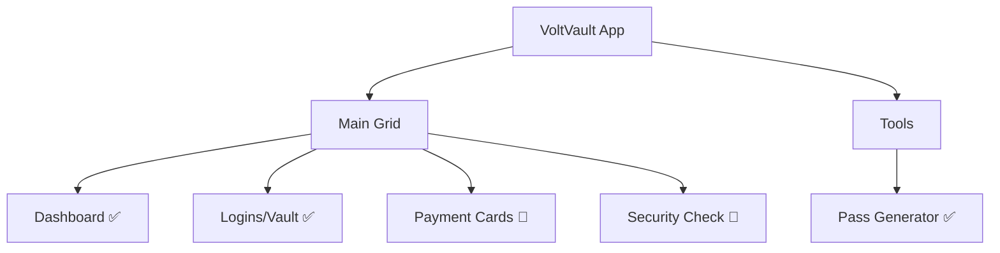

# VoltVault - Product Requirements Document

## 1. Product Overview

**VoltVault** is an enterprise password management application branded under "Eveready" with an industrial/energy-themed UI. The application allows users to securely store, manage, and access their credentials, payment cards, and secure notes.

### 1.1 Target Users
- Enterprise employees needing centralized credential management
- IT administrators managing organizational security
- Individual users requiring secure password storage

### 1.2 Core Value Proposition
- Secure, encrypted storage for credentials and sensitive data
- TOTP/2FA support for enhanced security
- Built-in password generation tools
- Security health monitoring and breach detection

---

## 2. Feature Assessment

### 2.1 Authentication System

| Feature | Status | Description |
|---------|--------|-------------|
| Email/Password Login | ✅ UI | Standard credential-based authentication |
| Password Reset | 🔲 UI Only | "RESET" link present but not functional |
| Session Management | 🔲 Mocked | Needs backend JWT/session tokens |

---

### 2.2 Dashboard

| Feature | Status | Description |
|---------|--------|-------------|
| Total Vault Count | ✅ UI | Shows stored credentials count |
| Security Health Score | ✅ UI | Battery-style percentage indicator |
| Weak Password Detection | ✅ UI | Count of weak passwords |
| Breach Alert Level | ✅ UI | LOW/MEDIUM/HIGH indicator |
| Recent Access Log | ✅ UI | Recently accessed items |

---

### 2.3 Vault Management

| Feature | Status | Description |
|---------|--------|-------------|
| List All Vault Items | ✅ UI | Filterable list with search |
| View Item Details | ✅ UI | Full details with copy functionality |
| Password Show/Hide | ✅ Implemented | Toggle visibility |
| Copy to Clipboard | ✅ Implemented | Username, password, URL |
| TOTP/2FA Display | ✅ Implemented | 30-second rotating codes |
| Item Filtering/Search | ✅ Implemented | Search by name or username |
| Edit/Delete Item | 🔲 UI Button Only | Buttons exist, no modals |
| Add New Item | 🔲 UI Button Only | Header button exists |

**Data Model:**
```typescript
interface VaultItem {
    id: string;
    type: 'login' | 'card' | 'note';
    name: string;
    username?: string;
    password?: string;
    url?: string;
    notes?: string;
    folderId?: string;
    favorite: boolean;
    totpSecret?: string;
    lastModified: string;
}
```

---

### 2.4 Password Generator

| Feature | Status | Description |
|---------|--------|-------------|
| Configurable Length | ✅ Implemented | Slider 8-32 characters |
| Character Options | ✅ Implemented | Letters, Numbers, Symbols |
| Strength Indicator | ✅ Implemented | Visual bars + color coding |
| Copy to Clipboard | ✅ Implemented | With visual feedback |

---

### 2.5 Placeholder Modules

| Module | Status |
|--------|--------|
| Payment Cards | 🔲 Under Maintenance |
| Security Check | 🔲 Under Maintenance |
| Settings | 🔲 Under Maintenance |

---

## 3. Navigation Structure



---

## 4. Technical Stack

| Layer | Technology |
|-------|------------|
| Frontend | React 19 + TypeScript |
| Build Tool | Vite 7 |
| Icons | Phosphor Icons |
| Styling | Vanilla CSS with CSS Variables |
| PWA | vite-plugin-pwa |

---

## 5. Priority Matrix

### P0 - Critical (MVP)
1. User Authentication Flow (Register, Login, Logout)
2. Vault CRUD Operations
3. Data Encryption (E2E)
4. Password Generator

### P1 - High Priority
1. TOTP Generation
2. Search & Filter
3. Folders/Categories
4. Favorites

### P2 - Medium Priority
1. Payment Cards Module
2. Secure Notes
3. Security Audit
4. Breach Monitoring

### P3 - Lower Priority
1. Settings/Preferences
2. Export/Import
3. Sharing
4. Audit Logs
